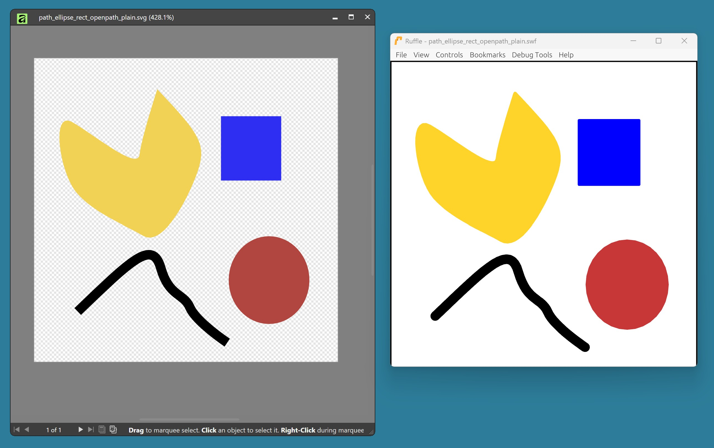

# `sfs` (svg_from_swf)



`sfs` is a standalone program for converting a simple subset of the SVG format to the Flash SWF format.
It is released in the [public domain](./LICENSE) and supports Windows and macOS.


## Usage

Find precompiled binaries in the [bin](./bin) folder or see [below](#Compilation).

If on macOS, you may need to first execute `chmod +x path/to/sfs.bin` to mark the binary executable.

Then, on either operating system, run:
```
path/to/sfs path/to/input.svg path/to/output.swf
```

`sfs` supports SVG rects, ellipses, and paths.


## Compilation

### Release mode

On Windows, run `build_releases.bat`. You need clang to compile for windows and zig to cross-compile for macos.

On macOS, run `build_releases.sh` (you might have to `chmod +x` first). You need zig.

### Debug mode

On windows, run `build.bat`. You need the MSVC toolchain.

On macOS, run `build.sh` (you might have to `chmod +x` first). You need clang.

